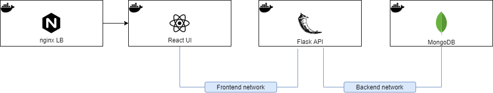

# **Docker Compose - Three tier application**

## **Architecture Diagram**

## **Information**

The application consists of a very basic React web application that gets data from the Flask API which is connected to a MongoDB.

The whole stack is built using Docker Compose.
